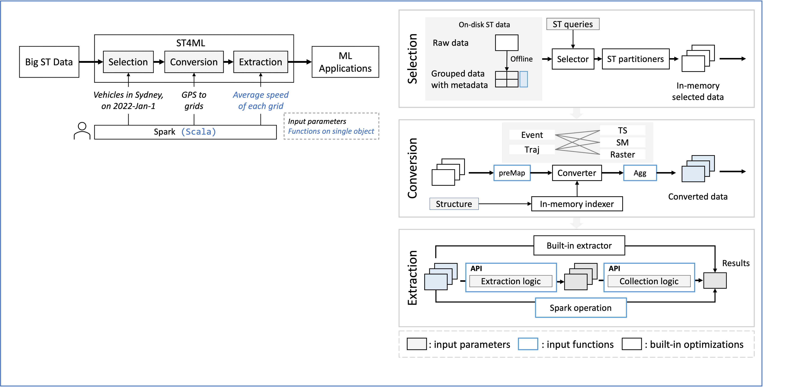

# ST4ML
ST4ML is an ML-oriented distributed spatio-temporal data processing system. 

ST4ML employs a three-stage pipeline *"Selection-Conversion-Extraction"* and designs five ST instances, where most ST feature extraction applications can fit.



**Dependencies:**
- Hadoop > 3.2 (for HDFS)
- Spark > 3.0.0
- Java > 1.8
- Scala > 2.12
- sbt > 1.55

Installation: 
```bash
sbt assembly
```
Applications run on `spark-submit` command. E.g.:

```bash
spark-submit \
 --class experiments.AnomalyExtraction \
 --master spark://master:7077 \
 --executor-memory 8g \
 --total-executor-cores 32 \
 --executor-cores 2 \
 --driver-memory 50g \
 --conf spark.kryoserializer.buffer.max=1g \
 --conf spark.default.parallelism=64 \
 ../target/scala-2.12/st4ml-assembly-3.0.jar /datasets/porto_taxi_point_0.4_tstr ../../point_0.4_metadata.json ../datasets/queries_10.txt 23,4 128
```

